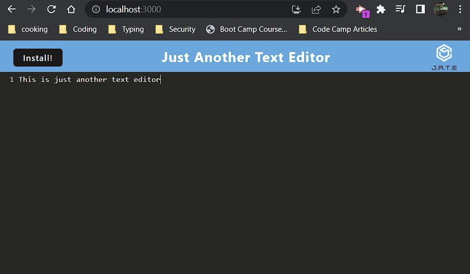

# PWA-Text-Editor

## Description

## Table of Contents

- [Installation](#installation)
- [Usage](#usage)
- [Credits](#credits)
- [License](#license)

## Deployment URL
https://cryptic-cove-68025-c6871024084a.herokuapp.com/

## Installation

What are the steps required to install your project? Provide a step-by-step description of how to get the development environment running.

## Usage

Provide instructions and examples for use. Include screenshots as needed.

To add a screenshot, create an `assets/images` folder in your repository and upload your screenshot to it. Then, using the relative filepath, add it to your README using the following syntax:

## Credits
Heroku Documentation:
https://devcenter.heroku.com/articles/deploying-nodejs

## License

MIT License